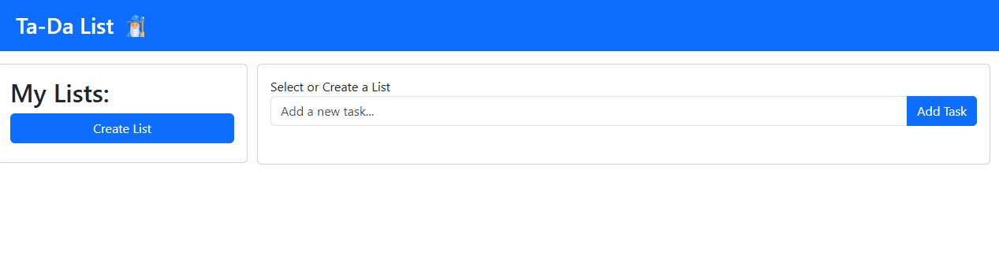

# Ta-da List 📝
## What is Ta-Da list?🧐
Ta-Da List is an interactive web application built with the Bootstrap CSS framework. It allows you to create and manage multiple to-do lists, making it easy to track and complete tasks across different projects. You can add as many lists and tasks as you need, giving you flexible control over your workflow.

## How does Ta-Da List Work ❓
Ta-Da List consists of a header area and a main area. The main area is structured as a Bootstrap row with two columns. The left-hand column contains a card titled "My Lists", which includes a "Create List" button for adding new to-do lists.
When you click the "Create List" button, a new list item is added to the "My Lists" card. This card functions as a navigation panel: clicking on any list will make it active and display its contents in the Active List card on the right-hand column.
The right-hand column contains the Active List card, where you can manage tasks for the selected list. To add a task, type it into the text area and either press Enter on your keyboard or click the "Add Task" button. Once a task is added, you can mark it as complete using the "Mark as Complete" button or remove it entirely with the "Delete Task" button.

